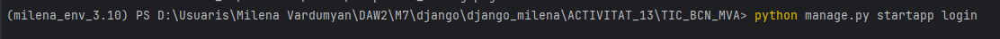
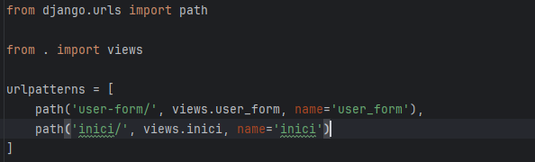
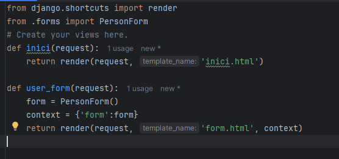
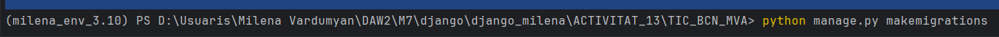
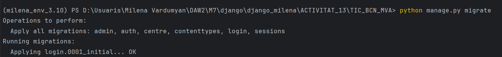
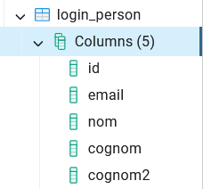

# django_milena

## ACTIVITAT 13

### Actividad 1:
Página de teachers y estudiantes desde la aplicación:

Página de teachers y estudiantes desde el proyecto:

### Actividad 2:
Video:
https://youtu.be/fsFmCkgOEWs

## ACTIVITAT 14

### Configuración del proyecto:

### Creación de la aplicación:
El comando para crear la app:

### Modelo usuario:

