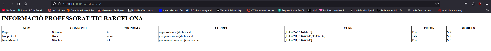
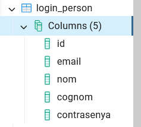

# django_milena

## ACTIVITAT 13

### Actividad 1:
Página de teachers y estudiantes desde la aplicación:

Página de teachers y estudiantes desde el proyecto:

### Actividad 2:
Video:
https://youtu.be/fsFmCkgOEWs

## ACTIVITAT 14

### Configuración del proyecto:

### Creación de la aplicación:
El comando para crear la app:

### Modelo usuario:

## Documentación de la funcionalidad del login sin session
Hacer un login sin session permite al usuario acceder sin tener que autentificarse ni iniciar sesión, de esta manera no es necesario hacer una consulta a la base de datos. 
### **Funcionamiento**
1. Cuando un usuario le da al botón de acceder sin iniciar sesión lo que hace es dirigirle directamente a la página de inicio.
2. En la página de inicio se le asigna el rol de invitado ya que no ha entrado con ninguna sesión.

## Documentación de la funcionalidad del login con session
Al hacer un login con session permite al usuario autentificarse con su correo electrónico y contraseña, que esta registrado en la base de datos.
### **Funcionamiento**
1. El usuario introduce su email y contraseña en el formulario.
2. Si las credenciales son correctas, se guarda su id y nombre en la sesión.
3. Después se redirige a la página de inicio, donde se muestra el nombre del usuario autentificado.

## Documentación de la funcionalidad del logout
Permite a los usuarios cerrar sesión, borrando la información de la sesión y devolviendo al usuario a la página del login.
### **Funcionamiento**
1. Borra toda la información de la sesión manual.
2. También cierra la sesión con Django.
3. Redirige al usuario a la pantalla del login.

